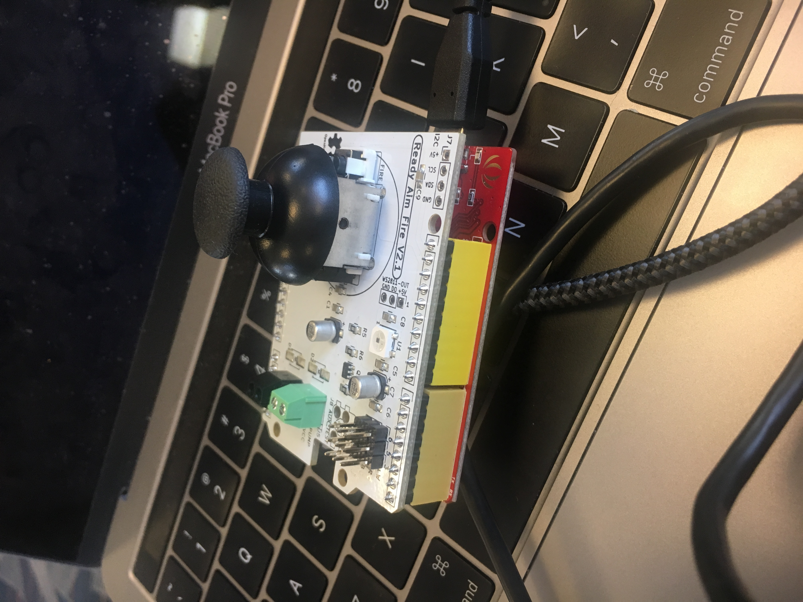

# avana

As part of the Capital One 2019 Hackathon, our team created an 8-bit joy stick driven text adventure game aimed towards teaching youth about financial literacy. 

Inspiration was driven by "gamefying" topics that are generally deemed boring and dense.

Thanks to all the mentors throughout the Summit, special shoutout to Heidi for teaching us how to use production grade Git!

Here is an image of the Seeeduino Joystick we implemented: 

